# Les_Vengeurs
Réalisé en équipe lors du 2ème Semestre 2021-2022 au Campus St-Charles Ste-Croix, ce projet avait pour but de mettre en pratique nos compétences HTML, CSS et PHP en créant un site dynamique sur le sujet de notre choix (Ici sur Marvel Comics).

<h3><b>Les différentes parties du site : </b></h3>

<b>L'accueil : </b>

 
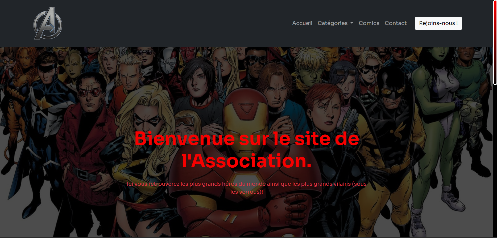
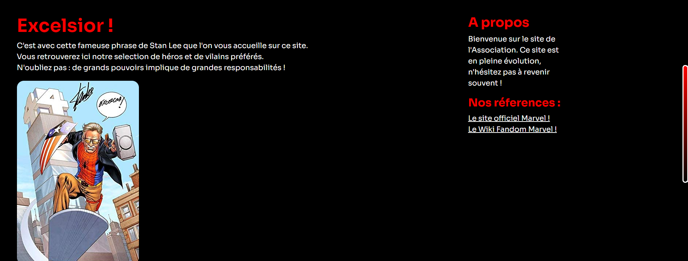
 
 

<b>Les pages Héros et Vilains :</b>

 
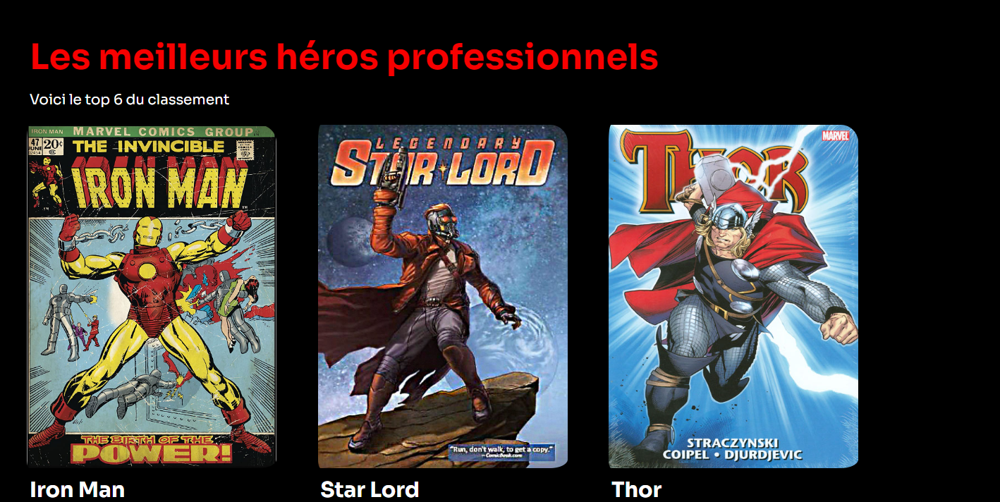
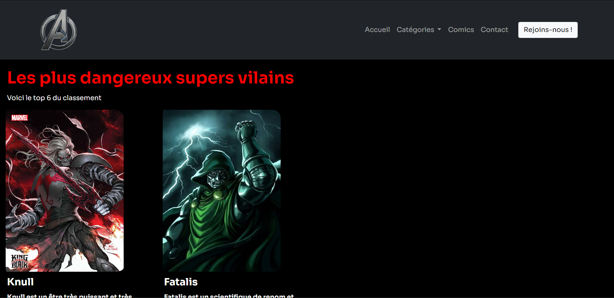
 
 

<b>La page Comics : </b>

 
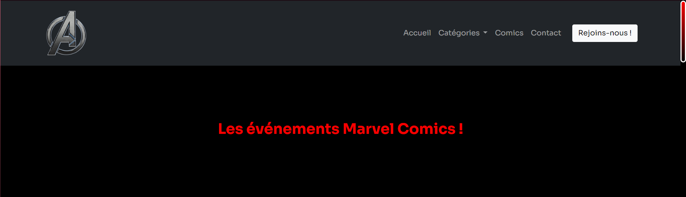
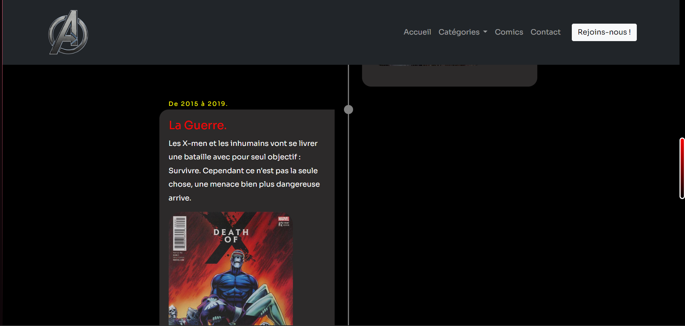
 
 

<b>La page Contact : </b>

 
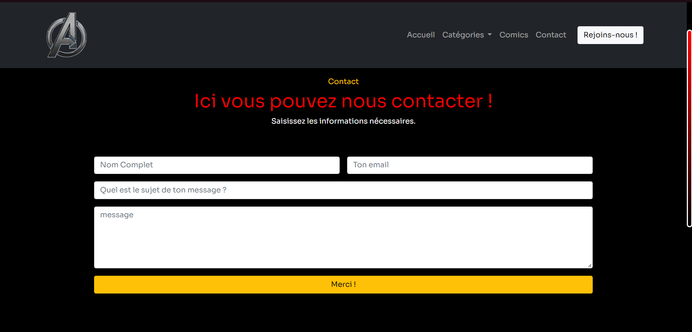
 
 

<b>La page de remerciement de contact : </b>

 
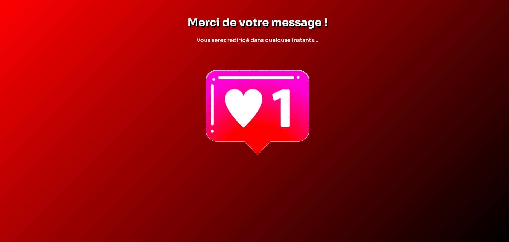

 
 

<b>La page Inscription : </b>

 
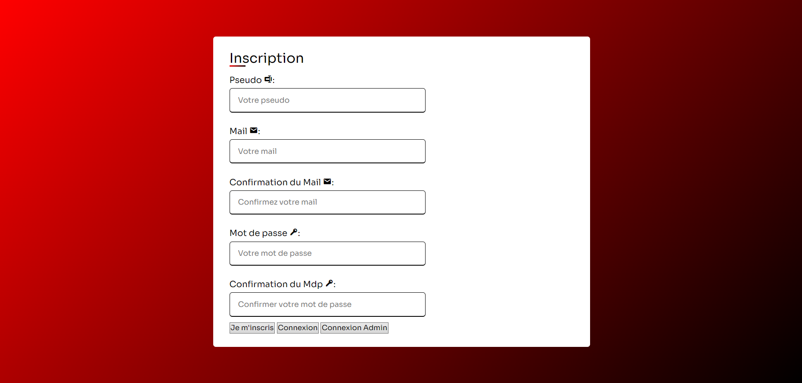

 
 

<b>La page Inscription : </b>

 

 
 

<b>La page Connexion des membres : </b>

 
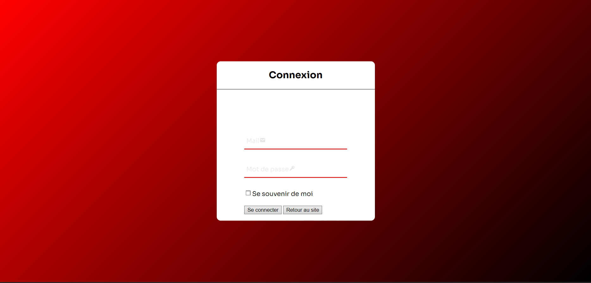

 
 

<b>La page Connexion Admin : </b>

 
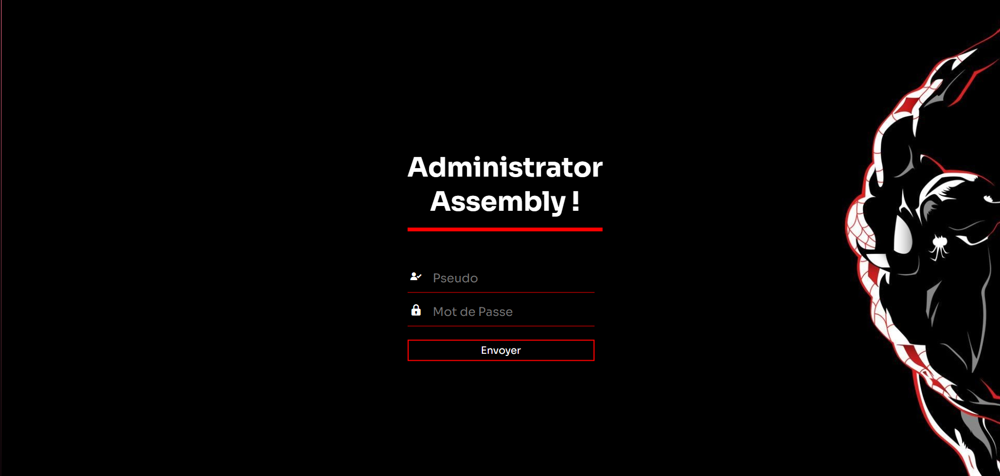

 
 

<b>La page du panneau d'action des Membres : </b>

 
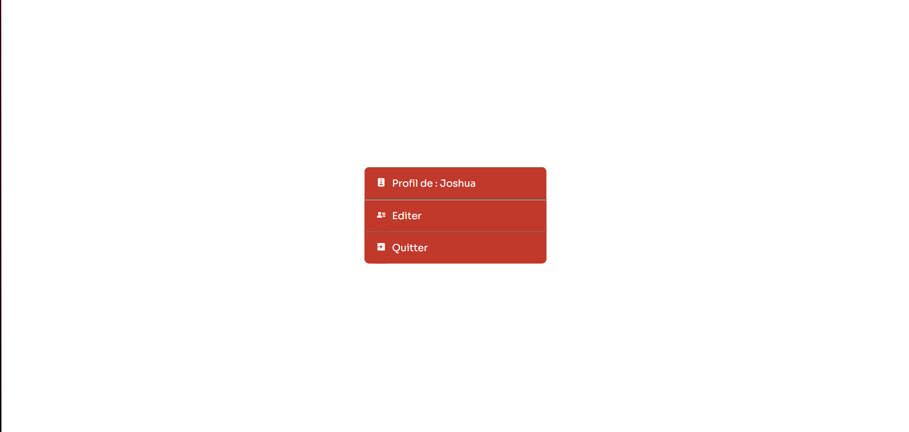

 
 

<b>La page d'édition du profil du membre : </b>

 
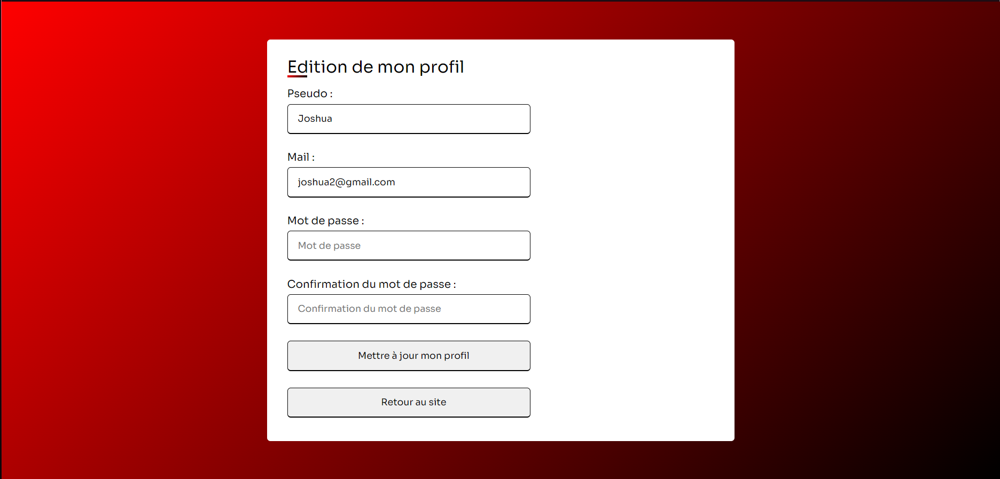

 
 

<b>La page du panneau d'action de l'administrateur : </b>

 
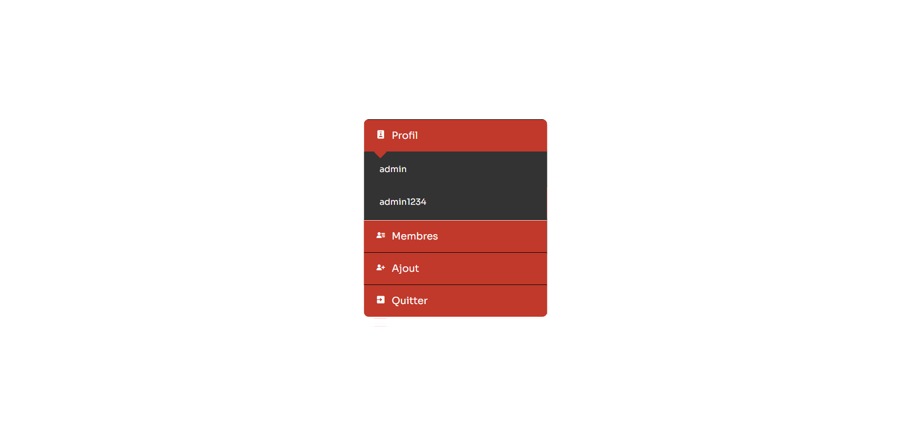

 
 

<b>La page de la liste des membres : </b>

 
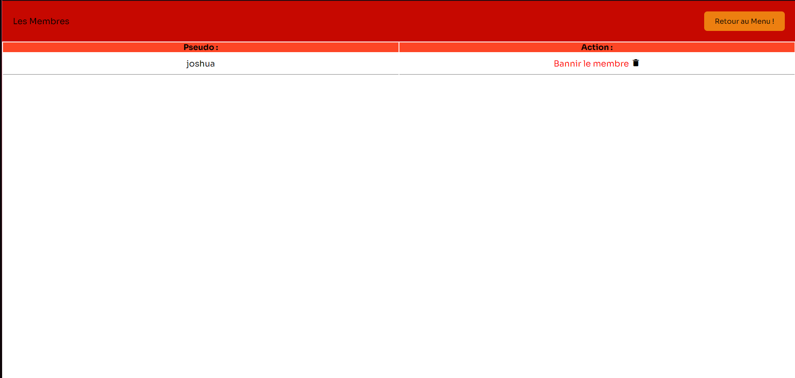

 
 

<b>La page d'ajout de personnages : </b>

 
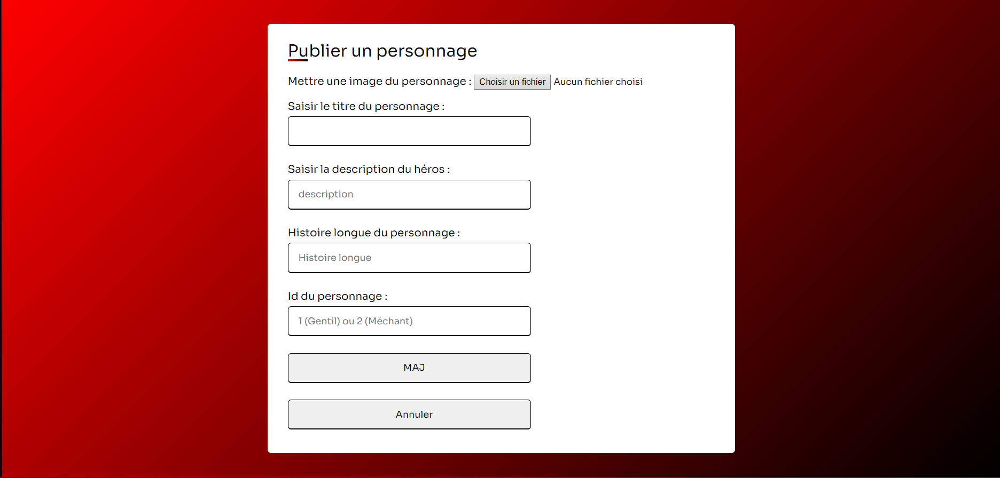

 
 
